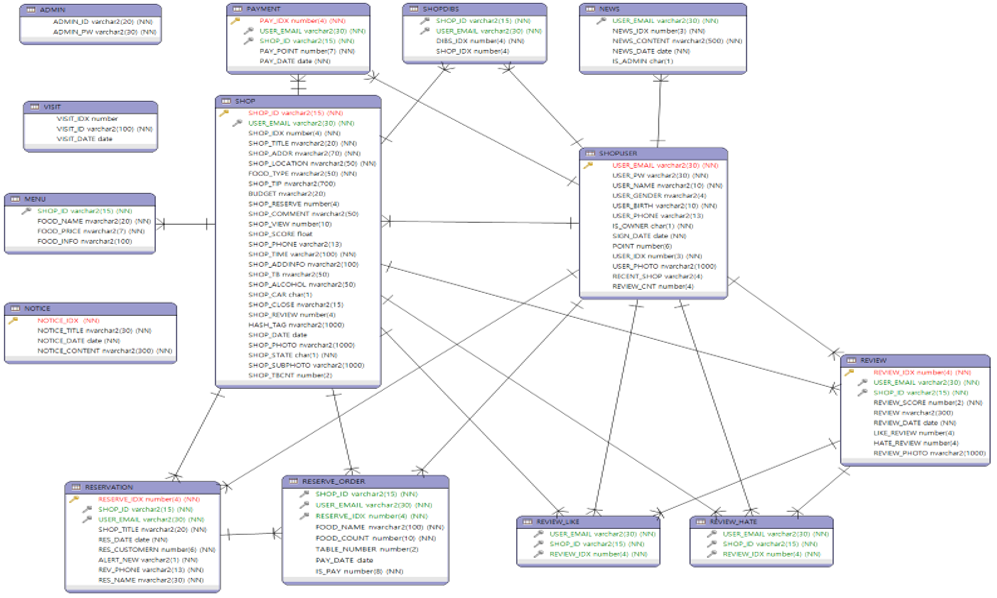

# 최종 프로젝트
# BabPool
- 시작날짜 : 2020년 09월 15일
- 완료날짜 : 2020년 10월 13일
  
### ✍️ 요약
- 사용 대상
    - 남녀노소 누구나
- 문제 의식
    - 현재 세계적인 질병으로 사회적 거리두기와 같이 사람들과의 접촉을 지양하는 사회에 살고 있다.
    - 대면으로 매장운영이 되는 방식이 사람들에게 불안감을 줄 수 있다는 우려가 있다.
- 제공 서비스
    - 요식업 매장운영 및 POS 시스템을 비대면(QR코드)으로 식당 예약 및 주문, 결제 서비스

### 🛠 사용 기술 및 라이브러리
- OS
    - Windows10
- 언어 / Tool
    - JAVA / Eclipse
    - JavaScript, jQuery, CSS, HTML
- Service System
    - Apache Tomcat
    - Spring
    - MyBaits
    - Android Studio
- Database
    - Oracle11
 
## 📊 ERD

## 🖥 담당한 기능
- Database 설계 및 구축
- 데이터 입출력 관리
- 유저 Mypage 개발
- 관리자 페이지 개발
- PPT 제작

## 📌 특징

- 한국 요식업 매장운영 및 사용자들을 위한 서비스입니다.
- WEB 및 APP을 통한 음식점 검색 및 예약을 할 수 있습니다.
- 음식점 테이블에 붙어있는 QR코드 스캔으로 편리한 주문 및 결제가 가능합니다. (APP)
- POS, APP, WEB Application을 연동하려 WEB이나 APP에서의 예약현황이나 주문결제내역 업데이트가 됩니다.

## 🖼️ 구현 이미지
